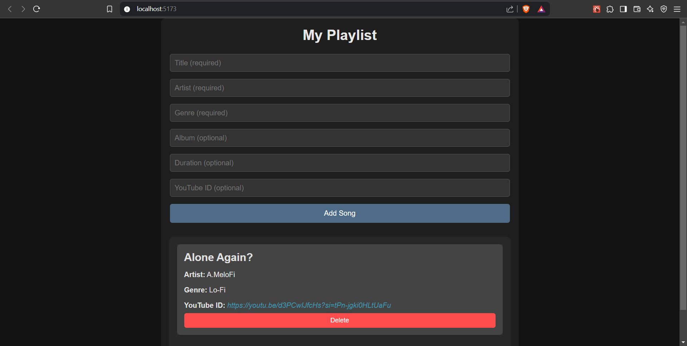
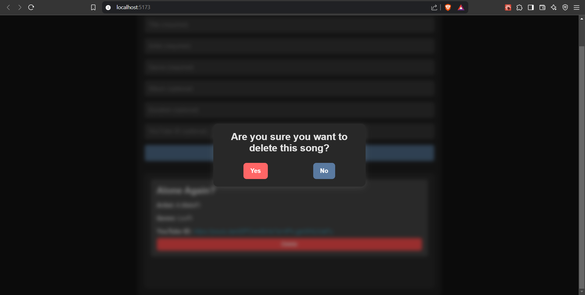

# MyPlaylist-App 🎵🎶

A full-stack playlist manager application built with React, Node.js, Express, and MongoDB. This app allows users to create and manage their playlists. 🎧

## Features ✨

- Create Playlists: Easily create new playlists. 📜

- Add Songs: Add songs to your playlists with song title, artist, and album details. 🎵

- Manage Playlists: Edit and delete playlists and songs. 📝❌

- Responsive Design: Works seamlessly on both desktop and mobile devices. 📱💻

## Technologies Used 💻

- **Frontend**: React, Vite

- **Backend**: Node.js, Express

- **Database**: MongoDB

- **Styling**: CSS (custom styling)

- **State Management**: React Context API / useState

## Installation 🚀

### Prerequisites 🛠️

- Node.js (v20 or higher)

- MongoDB (locally or using a service like MongoDB Atlas)

### Clone the Repository

Clone the repository to your local machine:

```bash
git clone https://github.com/Espadv69/MyPlaylist-App.git
cd MyPlaylist-App
```

### Install Dependencies

1. **Backend**: Navigate to the backend folder and install the dependencies.

```bash
cd backend
npm install
```

2. **Frontend**: Navigate to the frontend folder and install the dependencies.

```bash
cd frontend
npm install
```

## Environment Variables 🔑

Create a **.env** file in the **backend** folder with the following variables:

PORT=5000
MONGO_URI=your_mongodb_connection_string

## Running the App 🎉

### Run **backend**:

```bash
cd backend
node server.js
```

or from root folder

```bash
start
```

### Run **frontend**:

```bash
cd frontend
npm run dev
```

## Usage 📚

- Create Playlists: From the homepage, you can create a new playlist by entering a name and description. 🎨

- Add Songs: After creating a playlist, you can add songs with details like song name, artist, and album. 🎶

- Edit/Delete: Manage your playlists and songs by editing or deleting them as needed. ✂️

## Contributing 🤝

We welcome contributions to improve the project! To contribute:

1. Fork the repository. 🍴

2. Create a new branch (git checkout -b feature-name). 🌱

3. Commit your changes (git commit -am 'Add new feature'). 💻

4. Push to your branch (git push origin feature-name). 🚀

5. Create a new Pull Request. 🔄

## License 📜

This project is licensed under the ISC License.

## Screenshots

### Main

### Delete Modal

